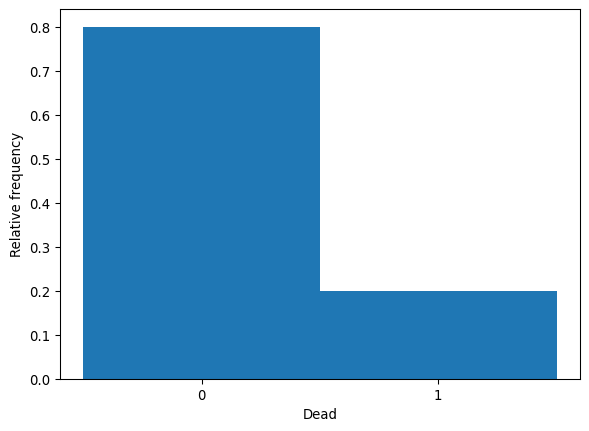
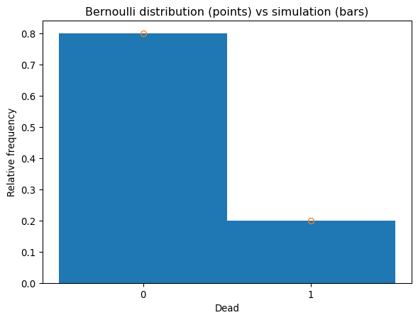
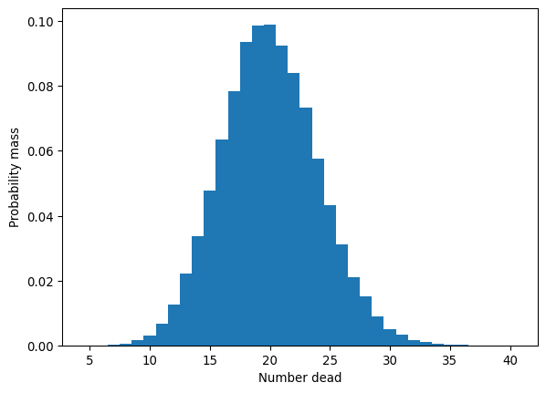
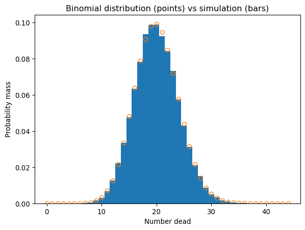

# Emergent Bernoulli and binomial distributions from an individual-based model (IBM)


## Learning goals

- Simulate **binary stochastic events** (e.g. death) in an
  individual-based model
- Recognize a **Bernoulli distribution** as the outcome
  (e.g. dead/alive) for an individual over realizations
- Recognize a **binomial distribution** as the outcome for total events
  (e.g. number of deaths) at the population scale
- Compare simulated discrete distributions to **theoretical PMFs**
- Understand how a population-level stochastic process **emerges** from
  individual-level dynamics via **scaling up**

## Code

See also lecture slides and video.

### RNG from last time

``` python
import numpy as np
import matplotlib.pyplot as plt

def rand_unif(n, seed):
    a = 16807
    m = 2147483647
    U = np.empty(n)

    I = seed
    for j in range(n):
        I = (a * I) % m
        U[j] = I / m

    return U, I
```

### Start the RNG

We’ll use the same seed as last time.

``` python
U, I_state = rand_unif(1, seed=74732)
```

### Individual-based model

Here was our individual-based model from last time.

- 100 individuals
- Probability of death in a year = 0.2

How many die in the first year?

``` python
N = 100
alive = np.full(N, 1)    #alive = 1
p_death = np.full(N, 0.2)

# Simulate death for each individual
for i in range(N):
    U, I_state = rand_unif(1, I_state)
    if U <= p_death[i]:
        alive[i] = 0    #individual dies

print(sum(alive))
print(sum(np.logical_not(alive))) #number dead
```

    85
    15

### Investigate the stochastic process

To investigate this stochastic process, we’ll simulate the
individual-based model multiple times.

First, we’ll package the individual-based model into a function.

``` python
def death_IBM(N, p_d, I_state):

    alive = np.full(N, 1)        #alive = 1
    p_death = np.full(N, p_d)

    for i in range(N):
        U, I_state = rand_unif(1, I_state)
        if U <= p_death[i]:
            alive[i] = 0     #individual dies

    return alive, I_state
```

Check that it works (aka one realization of the stochastic process).

``` python
alive, I_state = death_IBM(N=100, p_d=0.2, I_state=I_state)
print(alive)
print(sum(alive))
```

    [1 1 1 1 1 1 0 1 1 0 1 0 1 1 1 1 1 1 0 1 1 0 1 1 1 1 0 1 1 1 1 1 1 1 1 1 1
     1 1 1 1 1 1 1 1 1 0 1 1 1 1 1 1 0 1 1 1 1 1 1 1 1 1 1 1 0 1 1 1 1 1 1 1 1
     1 1 1 1 0 1 1 0 1 1 1 1 1 1 1 1 0 1 0 1 1 1 1 0 1 1]
    86

Then simulate the IBM repeatedly to get a sense of how variable the
biological process is and obtain its distribution.

``` python
U, I_state = rand_unif(1, seed=924505)

# Simulation control
sims = 100000

# Ecological parameters
N = 100
p_d = 0.2

# Storage for results
alive = np.empty((N, sims), dtype=int)

# Computation
for i in range(sims):
    alive[:,i], I_state = death_IBM(N, p_d, I_state)
    #if i % 1000 == 0:  # uncomment for monitoring
    #    print(i)

# Output
print(alive)   #each simulation is one column
```

    [[1 1 1 ... 0 1 0]
     [1 1 1 ... 0 1 1]
     [1 1 1 ... 1 0 1]
     ...
     [0 0 1 ... 0 1 1]
     [1 1 1 ... 1 1 1]
     [1 1 1 ... 1 1 1]]

We can start with a low number of simulations (e.g. sims = 10) to
inspect the output for problems then go for a large run if all is good.
Generally 10K - 100K simulations will give a picture of the distribution
that is not too noisy.

### Bernoulli distribution

There can be many different variables that have outcomes in an IBM. For
example, we can look at the dead/alive outcome for each individual.

Extract all the realizations for individual 37 (which is row index 37).
Individuals are indexed 0–99 in Python (offset indexing). We’ll convert
the `alive` vector to a `dead` vector by flipping the zeros and ones.
Now 1 indicates dead (think “dead = True”).

``` python
individual = 37
dead = (alive[individual,:] - 1) * -1 #convert alive to dead
```

Plot the distribution of outcomes (alive = 0, dead = 1) for this
individual.

``` python
plt.figure()
plt.hist(dead, bins=[-0.5, 0.5, 1.5], density=True)
plt.xticks([0, 1])
plt.xlabel("Dead")
plt.ylabel("Relative frequency")
```



In this IBM, each individual has its own Bernoulli distribution because
each binary stochastic event is independent and has the same
probability, $p_d$. Compare the IBM to the theoretical PMF. For a
Bernoulli random variable with probability $p$:

$P(X = 1) = p$

$P(X = 0) = 1 - p$.

Add the theoretical distribution to the histogram of simulations.

``` python
plt.plot([0, 1], [1-p_d, p_d], marker='o', linestyle='none', fillstyle='none')
plt.title("Bernoulli distribution (points) vs simulation (bars)")
```



The simulation and theoretical PMF are very close.

### Population-level outcome

Sum the columns to get the total alive or dead in the population.

``` python
N_alive = np.sum(alive, axis=0)
N_dead = np.sum(np.logical_not(alive), axis=0)
print(N_alive)
print(N_dead)
```

    [78 79 84 ... 73 72 84]
    [22 21 16 ... 27 28 16]

The number alive or dead at the **population scale** is, in one sense,
an **emergent** outcome of the individual-based process.

### Distribution of number dead

The number dead is a random variable with its own distribution. The
distribution is a PMF since number dead is discrete (an integer count in
this case).

``` python
plt.figure()
bins = np.arange(np.min(N_dead)-0.5, np.max(N_dead)+0.5+1)
plt.hist(N_dead, bins, density=True)
plt.xlabel("Number dead")
plt.ylabel("Probability mass")
```



The distribution of an outcome random variable from an individual-based
simulation like this can have any arbitrary distribution. Its
distribution may or may not be among the standard known (or even
unusual-but-known) distributions. **Simulating** the individual-based
model is a **universal** way of obtaining the distribution, which is
represented completely by the **histogram** of the simulated outcomes.

### Binomial distribution

Sometimes, the distribution of an outcome from a simple IBM might have a
known distribution. That is the case here. The outcome for `N_dead` (or
`N_alive`) is a binomial distribution.

The binomial distribution arises as the sum of multiple **independent**
Bernoulli trials with the **same probability**. That’s exactly what we
had in the death simulation: each individual had the same probability of
death $p_d$, a Bernoulli trial (binary stochastic event) occurred for
each individual, and the number dead is the sum across individuals.

In other words, when we **scaled up** from the individual-scale
stochastic process, we got a new but known stochastic process at the
higher scale of organization.

Functions for distributions in Python are in the stats module of the
**SciPy** library.

``` python
from scipy import stats
```

Now we can plot the theoretical PMF for the binomial distribution
against the outcome of the individual-based simulations.

``` python
X = np.arange(0, 45)
pmf = stats.binom.pmf(X, N, p_d)
plt.plot(X, pmf, marker='o', linestyle='none', fillstyle='none')
plt.title("Binomial distribution (points) vs simulation (bars)")
```



They are very close. The binomial distribution **emerges** from the
underlying biological stochastic process!

The mean and variance of the simulated number dead are also very close
to their theoretical values.

Theoretical mean (expected value):

$E[X] = Np$

``` python
print(N * p_d)
```

    20.0

Simulation mean:

``` python
print(np.mean(N_dead))
```

    20.00225

Theoretical variance:

$\mathrm{Var}(X) = Np(1-p)$

``` python
print(N * p_d * (1 - p_d))
```

    16.0

Simulation sample variance:

``` python
print(np.var(N_dead, ddof=1))
```

    16.064505582555825

## Summary

- Individual deaths are **binary stochastic events** (aka **Bernoulli
  trials**).
- The outcome for a single individual follows a **Bernoulli
  distribution**.
- The total number of deaths in the population **emerges** from the
  individual-level process.
- The population-level outcome, number of deaths, follows a **binomial
  distribution**.
- The simulated PMFs closely match the theoretical Bernoulli and
  binomial distributions.
- We can sometimes replace a complex individual-based model with an
  equivalent **emergent distribution**.
