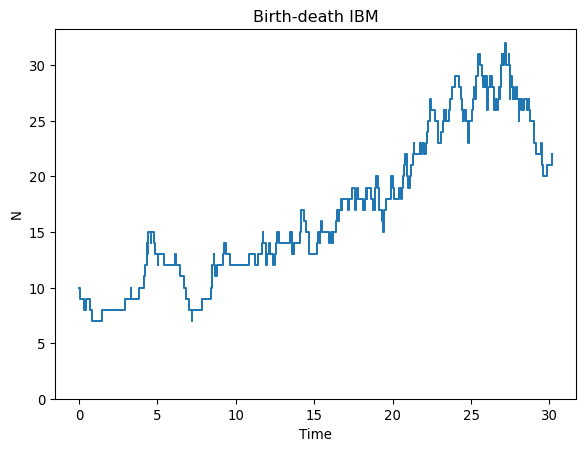

# Continuous-time birth-death IBM


Here we implement a continuous time individual-based model with two
processes, birth and death, using the Gillespie algorithm. Since this is
an IBM, each individual can have unique birth and death rates and so we
have not only two event types (birth, death) but also many possible
events, either a birth or death is possible for each of the N
individuals. Thus, there are 2 x N unique events in each Gillespie
iteration. Their rates sum together to give the intensity and their
individual probabilities determine which one of the 2 x N events
happens. Here, we use a two-stage approach to determine which event
occurs, first determining the event type and then determining the
individual it happens to. In this simple example, the birth and death
rates are the same for each individual but we build the code structure
needed to soon allow relaxing this assumption. This initial version is a
minimal implementation. In later versions we’ll improve computational
efficiency, track more state variables, and add biological complexity.

The basic algorithm is:

``` text
set system state
while condition
    calculate event intensity
    draw a waiting time w to next event (~ exponential)  
    advance time, t = t + w
    which event type occurs? (~ Bernoulli)
    which individual does the event happen to? (~ categorical)
    update system state (do event)
```

We also include code to track the population scale outcome so we can
plot the dynamics. Here is the Python implementation:

``` python
import numpy as np
import matplotlib.pyplot as plt

# Simulation control
rng = np.random.default_rng(95756)
t = 0
t_max = 30

# Initial biological state

# --individual scale
N_0 = 10
alive = np.full(N_0, 1)
b = np.full(N_0, 0.25)    # birth rate
m = np.full(N_0, 0.2)     # death rate

# --population scale
N_t = np.sum(alive) #scale transition (sum over individuals -> population)
N = N_t      #track N
times = t    #track time

# Simulate events
while t < t_max and N_t > 0:

    # calculate event intensity
    total_birth = np.sum(b * alive)
    total_death = np.sum(m * alive)
    intensity = total_birth + total_death

    # waiting time to next event
    w = rng.exponential(scale=1/intensity)
         
    # advance time
    t = t + w

    # which event type occurs?
    event_birth = rng.binomial(1, total_birth / intensity)    #1 = birth

    # which individual does the event happen to?
    i = rng.choice(np.where(alive == 1)[0])  #equal p, identical individuals

    # update system state (do event)
    if event_birth:
        # add a new individual and its traits
        alive = np.append(alive, 1)
        b = np.append(b, 0.25)
        m = np.append(m, 0.2)
    else:
        # death
        alive[i] = 0

    N_t = sum(alive)
    N = np.append(N, N_t)
    times = np.append(times, t)
```

Here is the state of the individuals at the end of the simulation. It’s
clear that all the original individuals died and most individuals alive
at the end are relatively young.

``` python
print(alive)
```

    [0 0 0 0 0 0 0 0 0 0 0 0 0 0 0 0 0 0 0 0 0 0 0 0 0 0 0 0 0 0 0 0 0 0 0 0 0
     0 0 0 0 0 0 0 0 0 0 0 0 0 0 0 0 0 0 0 0 0 0 0 0 0 0 1 0 0 0 0 0 0 0 0 0 0
     0 0 0 0 0 0 0 0 1 1 0 1 0 0 1 1 0 0 0 1 0 0 0 0 0 1 0 0 0 0 1 1 0 0 0 0 0
     0 1 0 0 1 0 0 0 0 1 0 1 0 1 0 1 0 0 0 0 1 0 1 1 1 1 1]

Plot the population dynamics over time

``` python
plt.figure()
plt.step(times, N, where='post')
plt.ylim(bottom=0)
plt.xlabel("Time")
plt.ylabel("N")
plt.title("Birth-death IBM")
```



Try running the model several times to get a sense for the range of
stochastic dynamics.
